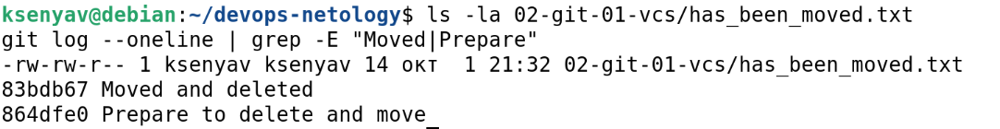

# Домашнее задание к занятию «Системы контроля версий»

**Выполнила:** Ксения Волчица

---

## Цель задания

- Научиться подготавливать новый репозиторий к работе.
- Научиться сохранять, перемещать и удалять файлы в системе контроля версий.

---

## Задание 1. Создать и настроить репозиторий для дальнейшей работы на курсе

### Создание репозитория и первого коммита

1. Зарегистрирован аккаунт на GitHub.
2. Создан публичный репозиторий `devops-netology` с галочкой **Initialize this repository with a README**.
3. Создан авторизационный токен для клонирования.
4. Репозиторий склонирован по HTTPS:

```bash
git clone https://github.com/kseniya-volchitsa/devops-netology.git
cd devops-netology
```

5. Настроен Git:

```bash
git config --global user.name "kseniya-volchitsa"
git config --global user.email "kkseniya-volchitsa@gmail.com"
```

6. Выполнена команда `git status` — файл `README.md` в состоянии **Unmodified**.
7. Отредактирован `README.md` — файл перешёл в состояние **Modified**.
8. Проверены изменения:

```bash
git diff           # показывает unstaged изменения
git diff --staged  # показывает staged изменения (пока пусто)
```

9. Файл добавлен в коммит:

```bash
git add README.md
git diff --staged  # теперь показывает изменения
```

10. Сделан первый коммит:

```bash
git commit -m 'First commit'
```

11. Проверены выводы `git status`, `git diff`, `git diff --staged`.

**Скриншоты:**


---

### Создание файлов .gitignore и второго коммита

1. Создан файл `.gitignore` в корне репозитория.
2. Файл добавлен в коммит:

```bash
git add .gitignore
```

3. Создан каталог `terraform` и внутри него файл `.gitignore` по примеру [Terraform.gitignore](https://github.com/github/gitignore/blob/master/Terraform.gitignore).
4. В `README.md` описано, какие файлы будут проигнорированы.
5. Сделан коммит:

```bash
git commit -m 'Added gitignore'
```

**Что игнорируется благодаря `.gitignore` в каталоге `terraform`:**

- `*.tfstate` и `*.tfstate.*` — файлы состояния Terraform.
- `.terraform/` — кеш провайдеров.
- `crash.log` — логи падений.
- `*.tfvars` — файлы с переменными (могут содержать секреты).
- `override.tf`, `override.tf.json` — временные override-файлы.
- `.terraformrc`, `terraform.rc` — конфиги CLI.

**Скриншоты:**


---

### Эксперимент с удалением и перемещением файлов

1. Созданы два файла:

```bash
echo "will_be_deleted" > will_be_deleted.txt
echo "will_be_moved" > will_be_moved.txt
```

2. Закоммичены:

```bash
git add will_be_deleted.txt will_be_moved.txt
git commit -m 'Prepare to delete and move'
```

3. Удалён файл `will_be_deleted.txt`:

```bash
git rm will_be_deleted.txt
```

4. Переименован `will_be_moved.txt` → `has_been_moved.txt`:

```bash
git mv will_be_moved.txt has_been_moved.txt
```

5. Сделан коммит:

```bash
git commit -m 'Moved and deleted'
```

**Скриншоты:**



---

### Проверка изменения

**Вывод `git log`:**

```bash
git log --oneline
```

**Ожидаемый результат:**

```
xxxxxxx (HEAD -> main, origin/main) Moved and deleted
xxxxxxx Prepare to delete and move
xxxxxxx Added gitignore
xxxxxxx First commit
xxxxxxx Initial commit
```

**Скриншоты:**


---

### Отправка изменений в репозиторий

```bash
git push origin main
```

---

## Итог

В результате выполнения задания:

- ✅ Создан и настроен локальный репозиторий.
- ✅ Создан удалённый репозиторий на GitHub.
- ✅ Выполнено 5+ коммитов.
- ✅ Настроены `.gitignore` для Terraform.
- ✅ Освоены `git add`, `git commit`, `git diff`, `git status`, `git rm`, `git mv`, `git push`.

---

## Ссылка на репозиторий

https://github.com/kseniya-volchitsa/devops-netology
