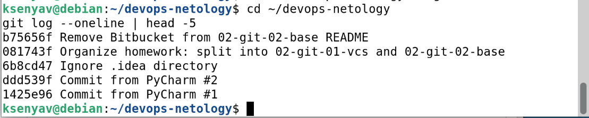
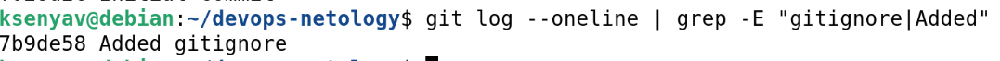
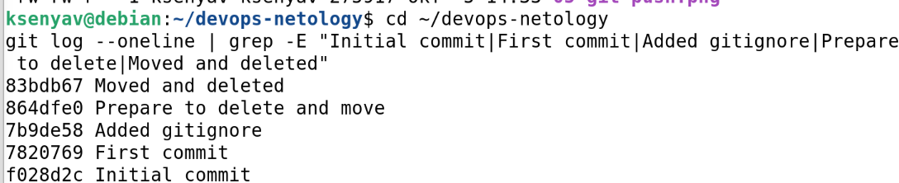
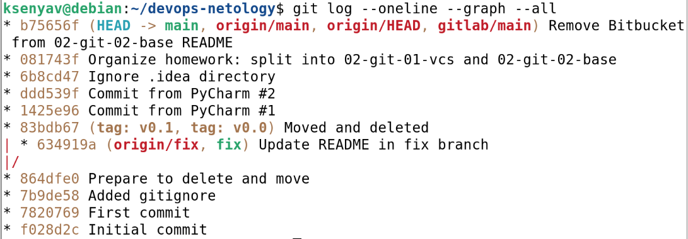
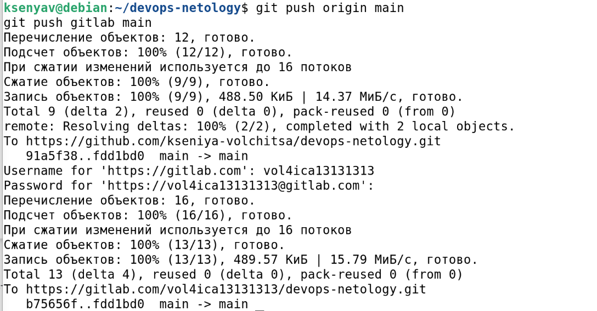

# Домашнее задание к занятию «Системы контроля версий»

**Выполнила:** Ксения Волчица

---

## Цель задания

- Научиться подготавливать новый репозиторий к работе.
- Научиться сохранять, перемещать и удалять файлы в системе контроля версий.

---

## Задание 1. Создать и настроить репозиторий для дальнейшей работы на курсе

### Создание репозитория и первого коммита

1. Зарегистрирован аккаунт на GitHub.
2. Создан публичный репозиторий `devops-netology` с галочкой **Initialize this repository with a README**.
3. Создан авторизационный токен для клонирования.
4. Репозиторий склонирован по HTTPS:

```bash
git clone https://github.com/kseniya-volchitsa/devops-netology.git
cd devops-netology
```

5. Настроен Git:

```bash
git config --global user.name "kseniya-volchitsa"
git config --global user.email "vol4ica13131313@gmail.com"
```

6. Выполнена команда `git status` — файл `README.md` в состоянии **Unmodified**.
7. Отредактирован `README.md` — файл перешёл в состояние **Modified**.
8. Проверены изменения:

```bash
git diff           # показывает unstaged изменения
git diff --staged  # показывает staged изменения (пока пусто)
```

9. Файл добавлен в коммит:

```bash
git add README.md
git diff --staged  # теперь показывает изменения
```

10. Сделан первый коммит:

```bash
git commit -m 'First commit'
```

11. Проверены выводы `git status`, `git diff`, `git diff --staged`.

**Скриншот:**



---

### Создание файлов .gitignore и второго коммита

1. Создан файл `.gitignore` в корне репозитория.
2. Файл добавлен в коммит:

```bash
git add .gitignore
```

3. Создан каталог `terraform` и внутри него файл `.gitignore` по примеру [Terraform.gitignore](https://github.com/github/gitignore/blob/master/Terraform.gitignore).
4. В `README.md` описано, какие файлы будут проигнорированы.
5. Сделан коммит:

```bash
git commit -m 'Added gitignore'
```

**Что игнорируется благодаря `.gitignore` в каталоге `terraform`:**

На языке правил `.gitignore`:
- символ `*` означает «любое количество любых символов»;
- символ `**` означает «любое количество любых символов, включая `/` (вложенные каталоги)»;
- строка без слэша и звёздочек — это точное имя файла или каталога;
- строка, начинающаяся с `#`, — это комментарий.

Расшифровка правил из файла `.gitignore`:

| Правило | Что игнорируется |
|---------|------------------|
| `**/.terraform/*` | Все файлы и подкаталоги внутри любого каталога `.terraform` на любом уровне вложенности |
| `*.tfstate` | Все файлы, имя которых **заканчивается** на `.tfstate` |
| `*.tfstate.*` | Все файлы, имя которых **содержит** `.tfstate.` (например, `terraform.tfstate.backup`) |
| `crash.log` | Файл с точным именем `crash.log` |
| `crash.*.log` | Все файлы, имя которых **начинается** на `crash.` и **заканчивается** на `.log` |
| `*.tfvars` | Все файлы, имя которых **заканчивается** на `.tfvars` |
| `*.tfvars.json` | Все файлы, имя которых **заканчивается** на `.tfvars.json` |
| `override.tf` | Файл с точным именем `override.tf` |
| `override.tf.json` | Файл с точным именем `override.tf.json` |
| `*_override.tf` | Все файлы, имя которых **заканчивается** на `_override.tf` |
| `*_override.tf.json` | Все файлы, имя которых **заканчивается** на `_override.tf.json` |
| `.terraformrc` | Файл с точным именем `.terraformrc` |
| `terraform.rc` | Файл с точным именем `terraform.rc` |

**Скриншот:**



---

### Эксперимент с удалением и перемещением файлов

1. Созданы два файла:

```bash
echo "will_be_deleted" > will_be_deleted.txt
echo "will_be_moved" > will_be_moved.txt
```

2. Закоммичены:

```bash
git add will_be_deleted.txt will_be_moved.txt
git commit -m 'Prepare to delete and move'
```

3. Удалён файл `will_be_deleted.txt`:

```bash
git rm will_be_deleted.txt
```

4. Переименован `will_be_moved.txt` → `has_been_moved.txt`:

```bash
git mv will_be_moved.txt has_been_moved.txt
```

5. Сделан коммит:

```bash
git commit -m 'Moved and deleted'
```

**Скриншот:**


---

### Проверка изменения

**Обязательные 5 коммитов:**

```bash
git log --oneline | grep -E "Initial commit|First commit|Added gitignore|Prepare to delete|Moved and deleted"
```

**Вывод:**

```
83bdb67 Moved and deleted
864dfe0 Prepare to delete and move
7b9de58 Added gitignore
7820769 First commit
f028d2c Initial commit
```

**Скриншот с 5 обязательными коммитами:**



**Полная история коммитов:**

```bash
git log --oneline
```

```
f028d2c Initial commit
7820769 First commit
7b9de58 Added gitignore
864dfe0 Prepare to delete and move
83bdb67 Moved and deleted
1425e96 Commit from PyCharm #1
ddd539f Commit from PyCharm #2
6b8cd47 Ignore .idea directory
081743f Organize homework: split into 02-git-01-vcs and 02-git-02-base
b75656f Remove Bitbucket from 02-git-02-base README
```

**Пояснение коммитов:**

| Хеш | Комментарий | Что сделано |
|-----|-------------|-------------|
| `f028d2c` | Initial commit | Создан GitHub при инициализации репозитория |
| `7820769` | First commit | Изменён `README.md` |
| `7b9de58` | Added gitignore | Добавлены `.gitignore` и `terraform/.gitignore` |
| `864dfe0` | Prepare to delete and move | Созданы `will_be_deleted.txt` и `will_be_moved.txt` |
| `83bdb67` | Moved and deleted | Удалён `will_be_deleted.txt`, переименован `will_be_moved.txt` → `has_been_moved.txt` |
| `1425e96` | Commit from PyCharm #1 | Коммит через IDE |
| `ddd539f` | Commit from PyCharm #2 | Коммит через IDE |
| `6b8cd47` | Ignore .idea directory | Добавлен `.idea/` в `.gitignore` |
| `081743f` | Organize homework | Разделение на папки `02-git-01-vcs` и `02-git-02-base` |
| `b75656f` | Remove Bitbucket | Убран Bitbucket из README второго ДЗ |

**Скриншот с полной историей:**



---

### Отправка изменений в репозиторий

```bash
git push origin main
```

**Скриншот:**



---

## Итог

В результате выполнения задания:

- ✅ Создан и настроен локальный репозиторий.
- ✅ Создан удалённый репозиторий на GitHub.
- ✅ Выполнено 5+ коммитов.
- ✅ Настроены `.gitignore` для Terraform.
- ✅ Освоены `git add`, `git commit`, `git diff`, `git status`, `git rm`, `git mv`, `git push`.

---

## Ссылка на репозиторий

https://github.com/kseniya-volchitsa/devops-netology
