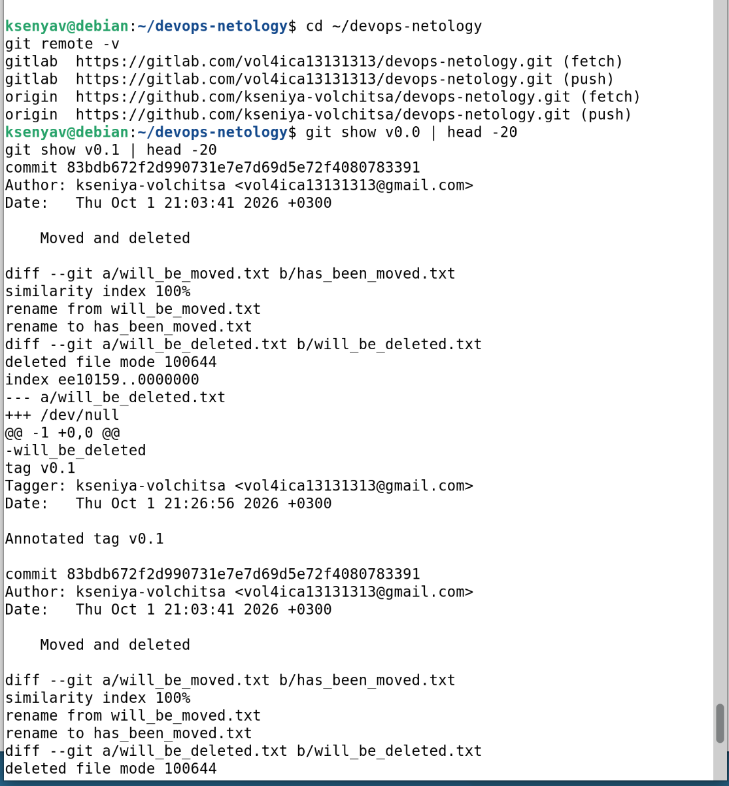

# Домашнее задание к занятию «Основы Git»

**Выполнила:** Ксения Волчица

---

## Цель задания

- Научиться работать с Git как с распределённой системой контроля версий.
- Настроить репозиторий для работы в GitHub, GitLab и Bitbucket.
- Попрактиковаться работать с тегами.
- Поработать с Git при помощи визуального редактора.

---

## Задание 1. Знакомимся с GitLab и Bitbucket

1. Создан аккаунт в GitLab.
2. Создан новый проект `devops-netology` (visibility level: **Public**, без README).
3. Добавлен GitLab как дополнительный remote:

```bash
git remote add gitlab https://gitlab.com/YOUR_LOGIN/devops-netology.git
```

4. Проверен вывод `git remote -v`:

```
gitlab	https://gitlab.com/YOUR_LOGIN/devops-netology.git (fetch)
gitlab	https://gitlab.com/YOUR_LOGIN/devops-netology.git (push)
origin	https://github.com/kseniya-volchitsa/devops-netology.git (fetch)
origin	https://github.com/kseniya-volchitsa/devops-netology.git (push)
```

5. Отправлены изменения в GitLab:

```bash
git push -u gitlab main
```

**Скриншоты:**



---

### Bitbucket (задание со звёздочкой)

1. Создан аккаунт и проект `netology` в Bitbucket.
2. Создан репозиторий `devops-netology` (Public, без README).
3. Добавлен Bitbucket как remote:

```bash
git remote add bitbucket https://bitbucket.org/YOUR_LOGIN/devops-netology.git
git push -u bitbucket main
```

4. Проверен вывод `git remote -v` — три remote: `origin`, `gitlab`, `bitbucket`.

**Скриншоты:**


---

## Задание 2. Теги

### Лёгкий тег v0.0

```bash
git tag v0.0
git push origin v0.0
git push gitlab v0.0
git push bitbucket v0.0
```

### Аннотированный тег v0.1

```bash
git tag -a v0.1 -m "Release v0.1"
git push origin v0.1
git push gitlab v0.1
git push bitbucket v0.1
```

### Разница между тегами

- **Лёгкий тег (`v0.0`)** — просто указатель на коммит, без дополнительной информации.
- **Аннотированный тег (`v0.1`)** — содержит автора, дату и сообщение. Полноценный объект в Git.

Проверить теги можно на страницах:

- GitHub: `https://github.com/YOUR_ACCOUNT/devops-netology/releases`
- GitLab: `https://gitlab.com/YOUR_ACCOUNT/devops-netology/-/tags`
- Bitbucket: в выпадающем меню веток на вкладке Tags.

**Скриншоты:**


---

## Задание 3. Ветки

1. Переключение на ветку `main`:

```bash
git switch main
```

2. Поиск коммита `Prepare to delete and move`:

```bash
git log --oneline
```

3. Переход на этот коммит по хешу:

```bash
git checkout <hash>
```

4. Создание новой ветки `fix`:

```bash
git switch -c fix
```

5. Отправка ветки в GitHub:

```bash
git push -u origin fix
```

6. Просмотр схемы коммитов: `https://github.com/kseniya-volchitsa/devops-netology/network`

7. Изменён файл `README.md` — добавлена новая строка.

8. Отправлены изменения:

```bash
git add README.md
git commit -m "Fix in branch"
git push origin fix
```

9. Проверена схема коммитов и вывод `git log`.

**Скриншоты:**


---

## Задание 4. Упрощаем себе жизнь

### Работа с Git через PyCharm

1. Открыт PyCharm → **View → Tool Windows → Git**.
2. Изменён файл — он появился на вкладке **Local Changes**.
3. Сделаны 2 коммита через интерфейс IDE (кнопка **Commit** внизу диалога).

**Скриншоты:**


---

## Итог

В результате выполнения задания:

- ✅ Настроены три remote (GitHub, GitLab, Bitbucket).
- ✅ Созданы лёгкий и аннотированный теги.
- ✅ Создана ветка `fix` от старого коммита.
- ✅ Выполнены коммиты через PyCharm.

---

## Ссылки на репозитории

- **GitHub:** https://github.com/kseniya-volchitsa/devops-netology
- **GitLab:** https://gitlab.com/vol4ica13131313/devops-netology
